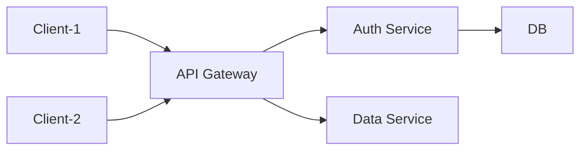

The blog works, it's ready for posts. dunno what I'll write about yet.

You may now access the octahedron:

<iframe width="560" height="315" src="https://www.youtube-nocookie.com/embed/akGpGA3jYek?si=PfIhwfi4t2E6x7N4" title="YouTube video player" frameborder="0" allow="accelerometer; autoplay; clipboard-write; encrypted-media; gyroscope; picture-in-picture; web-share" referrerpolicy="strict-origin-when-cross-origin" allowfullscreen></iframe>

## Mermaid diagram test

Blog post with embedded mermaid diagram 🫨



## Section Header

I can show code diffs like this:

```diff-js
 // this is a command
 function myCommand() {
+  let counter = 0;
-  let counter = 1;
   counter++;
 }

 // Test with a line break above this line.
 console.log('Test');
```
